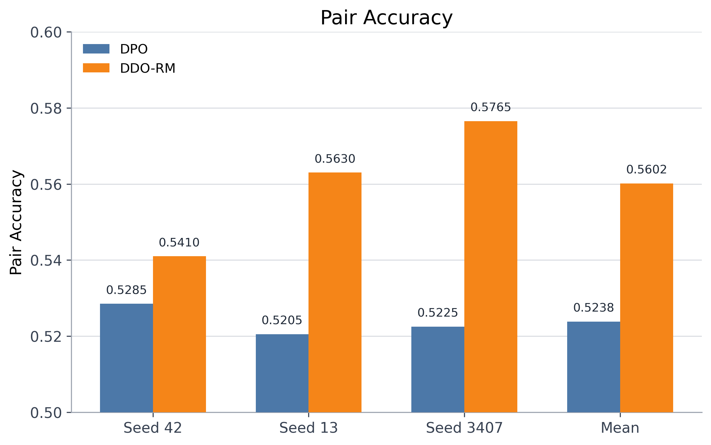
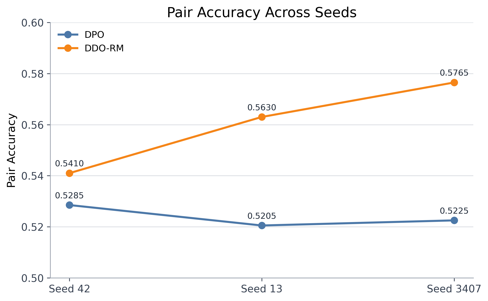
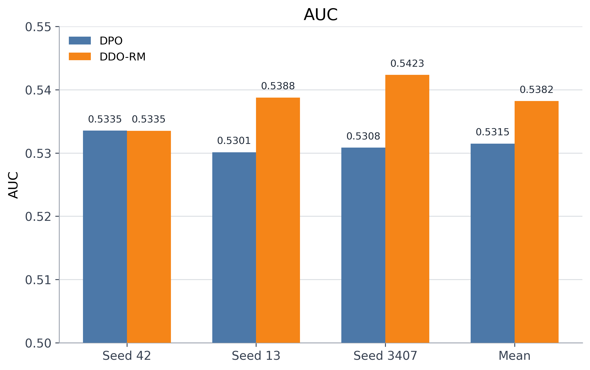
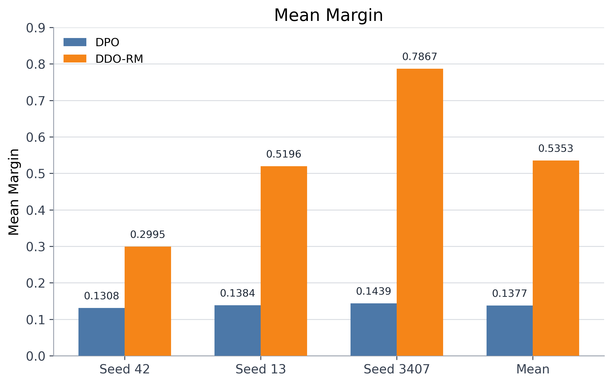

# 🔯 DEEP DECISION OPTIMIZATION 📈
DDO-RM for LLM Preference Optimization: A Minimal Held-Out Benchmark against DPO <p>
Tiantian(Crystal) ZHANG @ Columbia University Undegrad  contact: t.zhang8@columbia.edu, 
linkedin: crystal-zhangg, wechat: BestWillCome

& Jierui(Jerry) Zuo@ UW incoming Phd,Tsinghua undegrad contact: zuojr22@mails.tsinghua.edu.cn

& Siyu Lin ( @Yuanpei College Peking University, Tecent Hunyun, contact: siyu_lin@stu.pku.edu.cn 

List to be added, highly welcome collaborations, please shoot an email to crystal.cheung399@gmail.com( if educational one doesn't work)

Happy to connect and discuss ideas through email, and suggestion and questions are appreciated. 

This repository contains a minimal public benchmark for LLM preference optimization on a single held-out setting:

- Base model: `EleutherAI/pythia-410m`
- Dataset: `HuggingFaceH4/ultrafeedback_binarized`
- Evaluation split: `test_prefs`
- Seeds: `42`, `13`, `3407`
- Compared methods: `DPO` and `DDO-RM`

The goal is not to present a final comprehensive study. The goal is to provide a small, reproducible, held-out reference point for comparing a direct pairwise objective against a reward-guided decision-distribution objective.

Headline result: in this benchmark, `DDO-RM` outperforms `DPO` on all three reported seeds. Mean pair accuracy improves from `0.5238` to `0.5602`, AUC improves from `0.5315` to `0.5382`, and mean margin increases from `0.1377` to `0.5353`.

## What Problem This Repo Studies

Preference optimization methods are often evaluated through pairwise chosen-vs-rejected data. In that setup, the model is asked to score the chosen response above the rejected response for each prompt. DPO is the standard direct approach for this kind of supervision.

This repo studies whether a different view is useful even in this minimal pairwise regime: instead of optimizing only the binary pair relation, can we define a prompt-conditional distribution over candidate decisions and update the policy toward a reward-guided target distribution? That is the role of `DDO-RM` in this codebase.

## DDO / DDO-RM Explanation

DDO-RM starts from a different view of preference optimization than DPO. DPO learns directly from binary chosen-vs-rejected pairs, while DDO-RM treats each prompt as a finite decision problem over candidate responses. In this repo, a reward model supplies candidate-level scores, and those scores are used to build a soft target distribution rather than a hard binary label. That makes DDO-RM especially natural for finite-candidate or ranking-like settings, but this benchmark should be read as an empirical reference point rather than a claim of broader theoretical guarantees.

```text
p = softmax(policy_scores / temperature)
centered_reward = reward_scores - E_p[reward]
q = softmax((policy_scores + eta * centered_reward) / temperature)
loss = CE(q, p_theta)
```

The implementation of this decision-distribution step lives in `src/benchmark/ddorm.py` and `src/benchmark/trainer_ddorm.py`.

| Aspect | DPO | DDO-RM |
| --- | --- | --- |
| Training signal | Binary chosen vs rejected pair | Reward-model-induced soft target over candidates |
| Supervision view | Direct pairwise preference optimization | Decision distribution over a finite candidate set |
| Role of reward model | Not required in the core objective | Central: shapes the target distribution |
| Natural use case | Pairwise preference data | Finite-candidate, reranking, or ranking-like settings |
| Caution | Strong pairwise baseline | Can be more sensitive to reward-model quality and seed effects |

## Repository Structure

```text
.
|-- configs/                     DeepSpeed configs
|-- figures/                     Generated benchmark figures
|-- logs/                        Lightweight training logs kept for reference
|-- outputs/                     Checked-in metrics JSONs only
|-- scripts/                     Training and plotting scripts
|-- src/benchmark/               Training, evaluation, and DDO-RM implementation
|-- results_summary.csv          Compact benchmark summary table
|-- README.md
`-- requirements.txt
```

## Experiment Setting

| Item | Value |
| --- | --- |
| Task | Held-out pairwise preference evaluation |
| Base model | `EleutherAI/pythia-410m` |
| Dataset | `HuggingFaceH4/ultrafeedback_binarized` |
| Train splits used by scripts | `train_sft`, `train_prefs` |
| Evaluation split | `test_prefs` |
| Seeds | `42`, `13`, `3407` |
| Metrics | Pair accuracy, AUC, mean margin |
| Compared methods | `DPO`, `DDO-RM` |

## Main Results

### Pair Accuracy

| Method | Seed 42 | Seed 13 | Seed 3407 | Mean |
| --- | ---: | ---: | ---: | ---: |
| DPO | 0.5285 | 0.5205 | 0.5225 | 0.5238 |
| DDO-RM | 0.5410 | 0.5630 | 0.5765 | 0.5602 |

### Additional Metrics

| Metric | Method | Seed 42 | Seed 13 | Seed 3407 | Mean |
| --- | --- | ---: | ---: | ---: | ---: |
| AUC | DPO | 0.5335 | 0.5301 | 0.5308 | 0.5315 |
| AUC | DDO-RM | 0.5335 | 0.5388 | 0.5423 | 0.5382 |
| Mean Margin | DPO | 0.1308 | 0.1384 | 0.1439 | 0.1377 |
| Mean Margin | DDO-RM | 0.2995 | 0.5196 | 0.7867 | 0.5353 |

In this benchmark, `DDO-RM` is better than `DPO` on all three reported seeds for pair accuracy and mean margin, and on two of three seeds plus the mean for AUC. That is a useful signal, but it is still a small-scope result: one model family, one dataset, one held-out split, and three seeds.

The same data is available in [`results_summary.csv`](results_summary.csv).

## Figures

### Pair Accuracy



### Pair Accuracy Across Seeds



### AUC



### Mean Margin



## Reproduction

### 1. Install Dependencies

```bash
python -m venv .venv
source .venv/bin/activate
pip install -r requirements.txt
```

### 2. Run The Minimal Benchmark

Run the checked-in benchmark seeds individually:

```bash
bash scripts/run_minimal_dpo_single4090.sh 42
bash scripts/run_minimal_ddorm_single4090.sh 42

bash scripts/run_minimal_dpo_single4090.sh 13
bash scripts/run_minimal_ddorm_single4090.sh 13

bash scripts/run_minimal_dpo_single4090.sh 3407
bash scripts/run_minimal_ddorm_single4090.sh 3407
```

If you want a broader stage-1 pipeline, the repo also includes:

```bash
bash scripts/run_stage1_pythia410m_3seeds.sh
```

### 3. Regenerate The Summary Table And Figures

```bash
python scripts/plot_results.py
```

This writes:

- `results_summary.csv`
- `figures/pair_accuracy_bar.png`
- `figures/pair_accuracy_seed_lines.png`
- `figures/auc_bar.png`
- `figures/mean_margin_bar.png`

## Lightweight Public Repo Policy

This public snapshot intentionally keeps only lightweight artifacts:

- source code
- configs
- logs
- metrics JSONs
- generated figures
- documentation

Training checkpoints, optimizer states, scheduler states, and cache directories are intentionally excluded through `.gitignore`.

## Limitations And Caveats

- This is a minimal held-out benchmark, not a broad empirical study.
- The current public result covers only `Pythia-410M` on `UltraFeedback Binarized`.
- The evaluation is pairwise on `test_prefs`; it is not yet a listwise benchmark.
- Only three seeds are reported.
- No significance testing is included.
- `DDO-RM` depends on the quality of the reward model; weak reward scores can weaken the method.
- `DDO-RM` exhibits larger cross-seed variability than `DPO`, likely because it depends on both policy initialization and reward-model-induced soft targets. However, in this benchmark it consistently outperforms `DPO` on all three reported seeds.
- Mean margin is informative here, but its absolute scale is model- and scoring-dependent.

## Suggested Next Steps

- Extend the benchmark to larger candidate sets where the decision-distribution view is more native.
- Add listwise evaluation metrics such as top-1, NDCG, or Kendall tau where appropriate.
- Test more model scales and architectures.
- Compare against additional preference-optimization baselines using the same held-out protocol.
- Report confidence intervals or bootstrap uncertainty estimates.
- Analyze reward-model sensitivity, since DDO-RM inherits its strengths and weaknesses.
